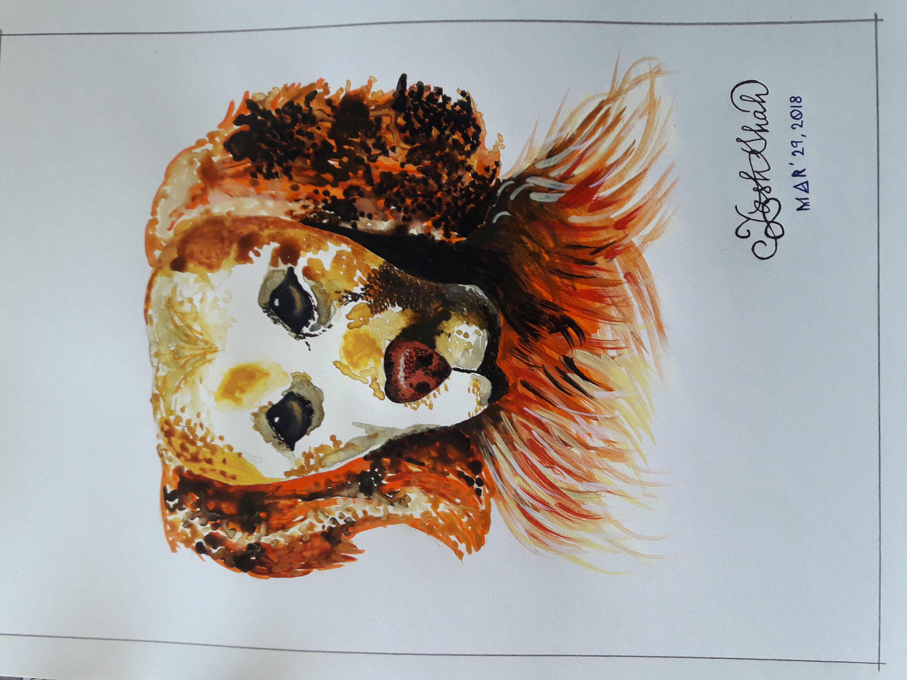

You might be wondering why is this painting of a dog the first thing I see on a developer's page? 

During the first week of my taking the *CSE 110: Software Engineering* course at UC San Diego, when I was sharing my hobbies with Professor Thomas Powell, he told me:
> I think we CS types are more varied than we like to admit and that partially keeps us from stretching and doing things we might or should do

And it is true. ~~STEM majors breathe STEM in place of air and drink STEM in place of water~~

There is much more to being a technical major than just coding, debugging, testing, or developing. I painted this image a couple of years ago and it reminds me of what I like to do in my spare time and that I am good at it. It is important to pursue a hobby as much as it is important to pursue a career.
